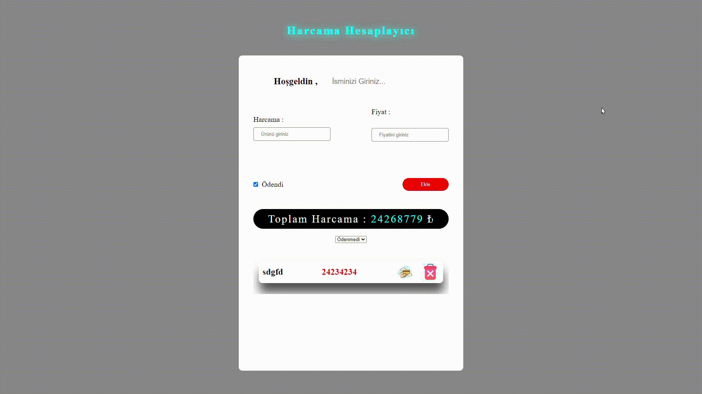

<h1> Harcama Hesaplama Projesi JS </h1>

  * Javascript kodları main dosyasında yer almaktadır.  
  * Htm kodlarımız index.html dosyasında yer almaktadır. 
  * İmages öğeleri  ımages dosyasında mevcuttur. 

 <h1> Yapılan İşlemler <h1>

* Kullanıcı ürün ve fiyat girdiği zaman ekleme işlemi yapabiliyor 
* Bu ekleme işlemi sonucu ürün fiyatı ile birlikte listeye eklenir  
* Ödendi imgesine tıklandığında  listedeki üründe değişiklik sağlandı 
* Eklenen ve silinen  ürünler ile toplam harcama güncellendi 
* Ödendi ödenmedi ve hepsi selectboxları ile listeyi değiştirdik  
* Ürün ve fiyat girilmesi olmadığında alert ile uyarı verildi 

Bu işlemleri javascript ile gerçekleştirdik 

<h2>Kullanilan Teknolojiler</h2>

-JAVASCRİPT 
-CSS  
-HTML 

<h1>Proje Gif</h1>

# Harcama-hesaplamaJS
